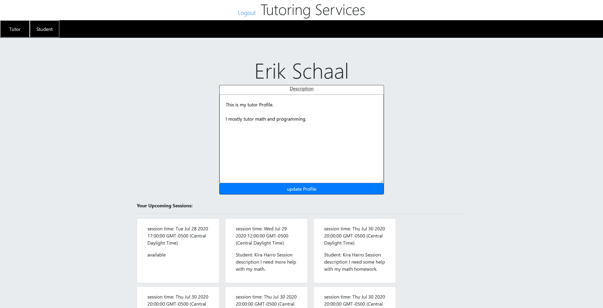

# tutorScheduler

*  An app for allowing tutor's to post availablity, and for students to sign up for available sessions. 

## Collaborators

* Erik Schaal
* Kent Schollmeier

## Usage

Everyone needs help on their assignments from time to time. We decided to create an application for both sides of the tutor coupling. You can create a profile and define whether you are a tutor a student or both. From there you are logged in and a page with two tabs appears. You can go between these tabs to see one side for the student and one side for the tutor. If you are a tutor you can create new sessions for students to sign up. As a student you can view these available sessions and sign up while adding a description for what you will need help with. The tutor then sees this description in their upcoming sessions. If you are not a student you can sign up to become a tutor and if you are not a student you can sign up to become a tutor.

